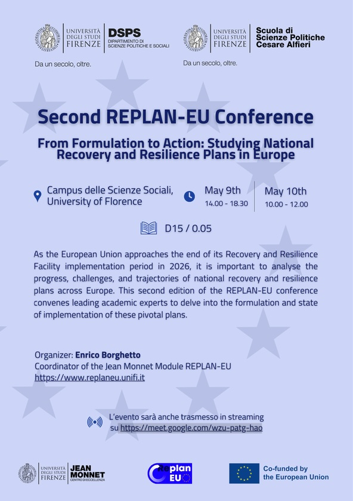

On May 9 and 10, 2024, I organized the Second REPLAN-EU Conference, titled "From Formulation to Action: Studying National Recovery and Resilience Plans in Europe". The event took place at the [Campus delle Scienze Sociali](https://www.google.com/search?q=https://www.unifi.it/p-vis2-2013-200021-0.html) of the [University of Florence](https://www.unifi.it/) and was hosted by the [Department of Political and Social Sciences (DSPS)](https://www.dsps.unifi.it/). As the coordinator of the [Jean Monnet Module REPLAN-EU](https://www.replaneu.unifi.it), I designed this workshop to analyze the progress and challenges of national recovery plans as the 2026 implementation deadline approaches.

The conference brought together leading academic experts to examine the transition from policy formulation to domestic action. On the first day, we held panels focused on the governance of the [Recovery and Resilience Facility](https://commission.europa.eu/business-economy-euro/economic-recovery/recovery-and-resilience-facility_en), performance-based financing, and comparative analyses of national plans. We also explored the legal and political dimensions of [Next Generation EU](https://commission.europa.eu/strategy-and-policy/recovery-plan-europe_en) ratification in specific contexts, such as Poland.

The second day featured a high-level round table where I was joined by colleagues from the [University of Amsterdam](https://www.uva.nl/), the [European University Institute (EUI)](https://www.eui.eu/), [LUISS](https://www.luiss.edu/), and the [University of Padua](https://www.unipd.it/). Our discussions addressed the politicization of the European Semester and gender mainstreaming within the Italian NRRP. For more details on the speakers and sessions, the full event poster is available [at this link](https://www.replaneu.unifi.it).

