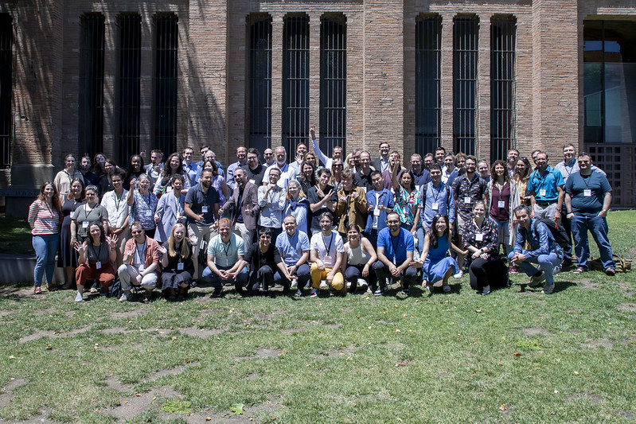

The Comparative Agendas Project Annual Conference took place in Barcelona from June 12 to June 14, 2024. This international gathering served as a central forum for scholars to discuss the evolution of policy agendas and the dynamics of political prioritization across various governance levels.

The event was jointly organized by the Department of Political Science of the University of Barcelona and the Institut Barcelona d’Estudis Internacionals (IBEI). The conference received financial support from both the Government of Spain and the Government of Catalonia.

The meetings were hosted at the Institut Barcelona d’Estudis Internacionals, located at the Campus de la Ciutadella (UPF) on Ramon Trias Fargas. These sessions provided an academic environment for researchers within the CAP network to share methodologies and comparative findings in the field of political science.

