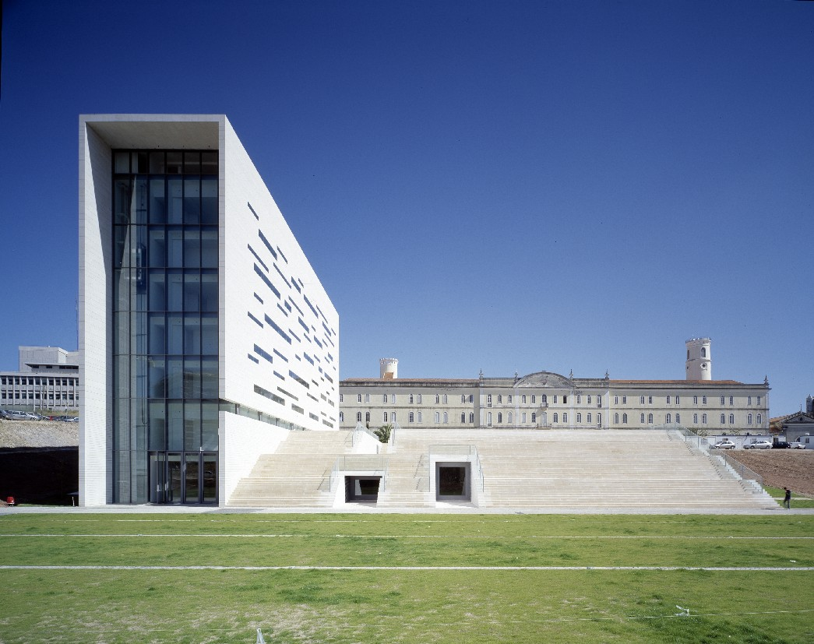

From June 19 to June 21, 2024, I participated in the [12th Biennial Conference of the Standing Group on the European Union (SGEU)](https://ecpr.eu/Events/184), hosted at [Universidade NOVA de Lisboa](https://www.unl.pt/en). This major international gathering brought together scholars of European integration to discuss contemporary challenges facing the Union.

On Friday, June 21, I presented my research in a panel focused on democratic processes, parliamentary oversight, and financial solidarity within the [Economic and Monetary Union (EMU)](https://economy-finance.ec.europa.eu/economic-and-monetary-union_en). The panel explored how institutional structures impact policy and examined the implications of the [Recovery and Resilience Facility (RRF)](https://commission.europa.eu/business-economy-euro/economic-recovery/recovery-and-resilience-facility_en) for the democratic scrutiny of public funds.

My contribution to the panel consisted of a paper titled "A comparative analysis of the formulation of National Recovery and Resilience Plans: domestic politics and ‘usages’ of Europe." The work employed a comparative framework to analyze how domestic actors utilized the opportunities provided by the EU to manage the post-pandemic economic recovery and the formulation of their respective [National Recovery and Resilience Plans (NRRPs)](https://commission.europa.eu/business-economy-euro/economic-recovery/recovery-and-resilience-facility_en#national-recovery-and-resilience-plans).

