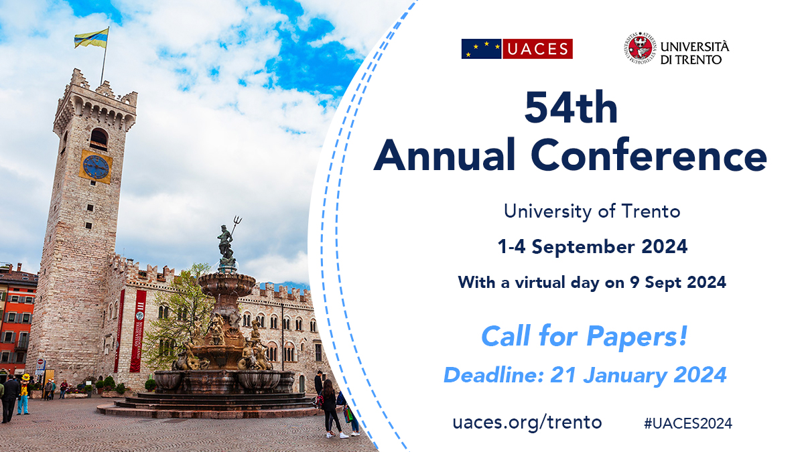

From September 1 to 4, 2024, the [University of Trento](https://www.unitn.it/en) hosted the 54th [UACES](https://www.uaces.org/) Annual Conference in Trento, Italy. The event brought together a global community of experts to exchange innovative research in European Studies, complemented by a virtual session on September 9.

During the conference, I presented a paper titled "**Stronger Conditionality for Stronger Compliance? Analyzing NGEU's Effect on the Implementation of European Semester Recommendations**". This research, co-authored with Igor Guardiancich, Lucia Quaglia, and Mattia Guidi, examines the capacity of the European Union to influence policy change through the Recovery and Resilience Facility (RRF) introduced under the [Next Generation EU](https://commission.europa.eu/strategy-and-policy/recovery-plan-europe_en) (NGEU) package. Our findings indicate that the financial incentives provided by the RRF have significantly improved member states' compliance with country-specific recommendations, effectively reshaping EU economic governance.

The presentation took place on September 2 within the panel "**Implementing the Recovery and Resilience Agenda: Politicisation, Constraints and Power Shifts**," chaired by Adina Akbik. This session offered a unique space for academic growth and collaboration, allowing for in-depth discussions on the transition from non-enforceable recommendations to a system where compliance is directly tied to funding.

