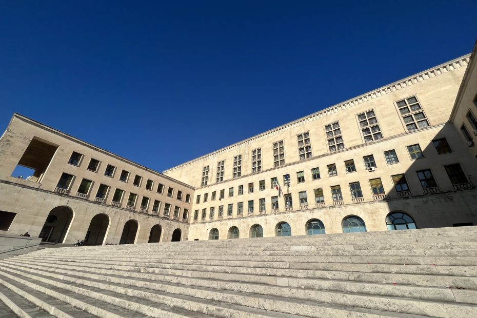

The 2024 edition of the [SISP (Società Italiana di Scienza Politica)](https://www.sisp.it/) Annual Conference was held from September 12 to 14 at the [University of Trieste](https://www.units.it/). Hosted by the [Department of Political and Social Sciences](https://dispes.units.it/), the event centered on the theme "Europe and Borders: Democracy, Union and States" and brought together a wide community of scholars to discuss the current trajectory of European and global politics.

During the conference, I presented two papers focused on the Recovery and Resilience Facility and the Next Generation EU (NGEU) framework. The first, "Stronger Conditionality for Stronger Compliance? Analyzing NGEU’s Effect on EU Policy Implementation" (co-authored with Igor Guardiancich, Mattia Guidi, and Lucia Quaglia), examined the impact of NGEU's conditionalities on domestic policy. The second, "A comparative analysis of the formulation of National Recovery and Resilience Plans: domestic agency and strategic usages of Europe" (co-authored with Lucia Quaglia and Igor Guardiancich), explored the domestic dynamics involved in drafting these national plans.

Beyond my presentations, I served as a discussant for Panel 11.10, "From austerity to socialization: Adaptations of European economic governance to crisis policymaking," which analyzed the shifts in EU economic governance following recent global crises.

A particularly significant moment of the conference was the business meeting of the Standing Group on ["Government, Parliaments and Representation](https://standinggroups.sisp.it/governmentparliamentrepresentation/)." I am honored to share that I was elected as the new coordinator for this standing group.

