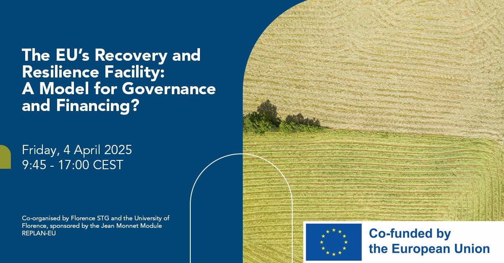

On Friday, April 4, 2025, the final conference of the Jean Monnet Module REPLAN-EU was held at the Elinor Ostrom Room in Palazzo Buontalenti, Florence. The event, titled "The EU's Recovery and Resilience Facility: A Model for Governance and Financing?", examined the practical implementation and long-term implications of the Recovery and Resilience Facility (RRF).

I co-organized this event alongside [Jonathan Zeitlin](https://www.uva.nl/en/profile/z/e/j.h.zeitlin/j.h.zeitlin.html) from the [University of Amsterdam](https://www.uva.nl/) and [David Bokhorst](https://www.google.com/search?q=https://www.eui.eu/people%3Fid%3Ddavid-bokhorst) from the [European University Institute](https://www.eui.eu/). The conference was a joint initiative between the [School of Transnational Governance (STG)](https://www.eui.eu/en/academic-units/school-of-transnational-governance) and the [Department of Political and Social Sciences (DSPS)](https://www.dsps.unifi.it/) at the [University of Florence](https://www.unifi.it/). For those interested in the full details of the sessions and speakers, the official event poster is available for download [here](https://www.dropbox.com/scl/fi/7gcjzw70q4g8yc19a0atl/The-EU-s-Recovery-and-Resilience-Facility-A-Model-for-Governance-and-Financing.pdf?rlkey=m87oew4dw4xo3tk7v7qkuzwa5&dl=0).

The program brought together academic researchers and high-level practitioners to discuss whether the RRF serves as a blueprint for future EU governance. Participants analyzed the facility's impact on the [European Semester](https://www.google.com/search?q=https://economy-finance.ec.europa.eu/economic-and-governance-process/european-semester_en) recommendations and the role of subnational authorities in its execution. Key insights were shared by representatives from the [European Commission](https://commission.europa.eu/index_en), the [European Court of Auditors](https://www.eca.europa.eu/en), and national administrations involved in monitoring recovery plans in Italy and Portugal.

The discussions highlighted the tension between executive dominance and parliamentary scrutiny, as well as the challenges of implementing reforms within the EU’s "neoliberal periphery". As the [European Union](https://european-union.europa.eu/index_en) prepares for the next [Multiannual Financial Framework (MFF)](https://www.google.com/search?q=https://commission.europa.eu/strategy-and-policy/prov-budget/long-term-eu-budget_en), the lessons learned from the RRF model remain central to debates regarding the future of cohesion funding and economic stabilization.

