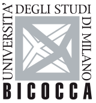

On April 23 and 24, 2025, I conducted a series of lectures for the PhD program in [Risorse per la nuova Amministrazione Pubblica](https://www.unimib.it/studiare/dottorato-ricerca/corsi-dottorato/risorse-nuova-pa-persone-e-dati) at the [University of Milano-Bicocca](https://www.unimib.it/). The sessions focused on the formulation, implementation, and evaluation of National Recovery and Resilience Plans (RRPs) within the framework of the NextGenerationEU (NGEU) initiative.

The teaching modules traced the evolution of European economic governance, moving from the constraints of the Eurocrisis to the solidarity-based model of the Recovery and Resilience Facility (RRF). I discussed the structural innovations of the RRF, specifically the shift toward performance-based financing where disbursements are tied to the fulfillment of qualitative milestones and quantitative targets rather than simple cost reimbursements.

We examined the comparative implementation rates across Member States, using indicators such as the Synthetic Performance Index to assess efficiency. The lectures also addressed the "Rule of Law" conditionality and the technical challenges of revising plans under Article 21 of the RRF Regulation. These discussions provided the doctoral candidates with a theoretical and empirical toolkit to analyze how the RRF model might influence future Multiannual Financial Frameworks (MFF) and the broader landscape of European public administration.

