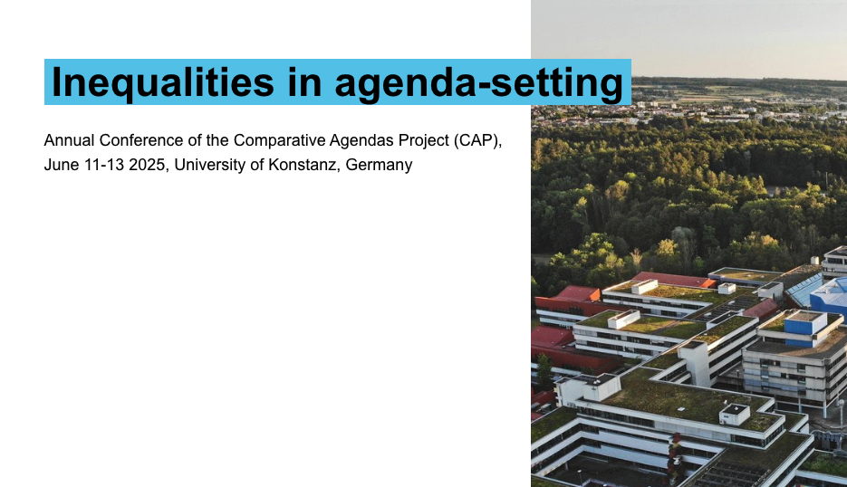

The [Comparative Agendas Project](https://www.comparativeagendas.net/) (CAP) Annual Conference 2025 took place at the [University of Konstanz](https://www.uni-konstanz.de/en/) from June 11 to 13. This gathering brought together an international community of scholars to discuss the latest advancements in agenda-setting research and policy dynamics. Hosted at the University’s Gießberg campus, the event featured a rich program ranging from the application of large-scale text classification to the analysis of populist moods in Europe.

The conference was organized with the support of the Cluster of Excellence "The Politics of Inequality" and the Zukunftskolleg. Sessions highlighted how methodological innovations, such as leveraging Large Language Models (LLMs), are transforming the way researchers measure political complexity and reproducibility across different languages and political systems. The collaborative spirit of the CAP network was further emphasized during the closing plenary, which reflected on the project's long-term contribution to comparative political science.

In the session dedicated to unequal representation, I presented the paper "Generational Gaps in Issue Responsiveness in the European Parliament," co-authored with Marcello Carammia and Henrik Bech Seeberg. Our study examined whether the issue priorities of younger citizens are reflected in the questions posed by Members of the European Parliament. Using a dataset of over 150,000 parliamentary questions and Eurobarometer surveys, we found a significant responsiveness gap that favors older generations. The findings suggested that the current legislative environment lacks a "youth boost," as even younger MEPs do not significantly increase the representation of youth-specific policy concerns.\

