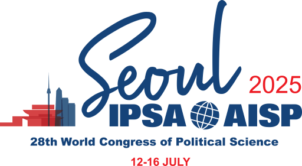

The 2025 [IPSA World Congress of Political Science](https://www.ipsa.org/events/congress/seoul2025) was held from July 12 to 16, 2025, at the [Coex Convention Center](https://www.coexcenter.com/) in Seoul, South Korea. Organized by the [International Political Science Association (IPSA)](https://www.ipsa.org/) in collaboration with the Korean Political Science Association, the event centered on the theme "Resisting Autocratization in Polarized Societies".

During the congress, I presented the paper "The Digital Transformation of Parliaments in the Wake of the Pandemic," a study co-authored with Federico Russo from the [University of Salento](https://www.unisalento.it/). The research utilized data from the Parliament in the Pandemic (PIP) network to analyze how and why parliaments adapted their operations through digital tools during the first two years of the COVID-19 crisis.

In addition to my paper presentation, I chaired a panel titled "Digital Transformation and Parliamentary Functioning: Redefining Roles, Power Dynamics, and Legislative Processes". This session, featuring Marco Lisi from the [Universidade Nova de Lisboa](https://www.unl.pt/en) as discussant, examined how technological shifts are altering the political balance within legislative branches and reshaping the internal dynamics between elites and backbenchers.

