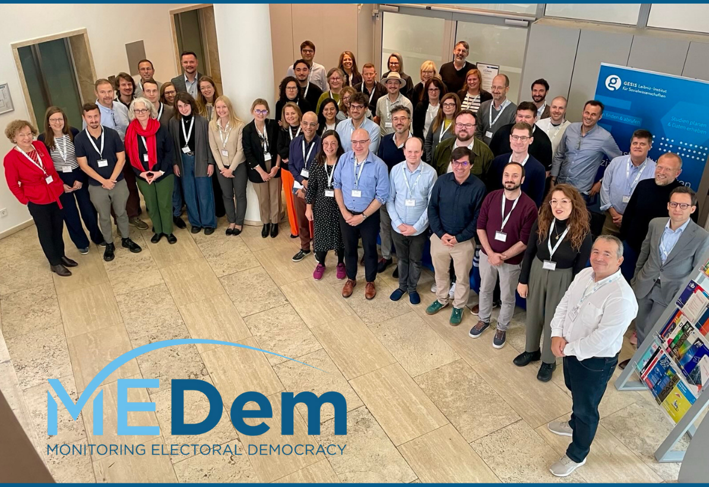

The [MEDem Conference 2025](https://www.medem.eu/from-data-to-impact-medem-conference-2025/) took place at [GESIS – Leibniz Institute for the Social Sciences](https://www.gesis.org/en/home) in [Cologne](https://www.google.com/search?q=https://www.stadt-koeln.de/en/). Over the course of two days (September 29-30), researchers, policymakers, and data experts gathered to exchange insights on the evolving needs of data-driven democracy research.

I participated in the event in my capacity as the coordinator for the **Data Service Centre for Country and Institutional Data** based in [Florence](https://www.google.com/search?q=https://www.comune.fi.it/).

The event featured a series of inspiring keynotes, lively discussions, and hands-on tool demonstrations. These sessions provided a dedicated space for international collaboration and underscored the mission of [MEDem](https://www.medem.eu/) to foster a more integrated research community. The gathering facilitated a deeper understanding of how high-quality data can be transformed into meaningful academic and social impact. 
